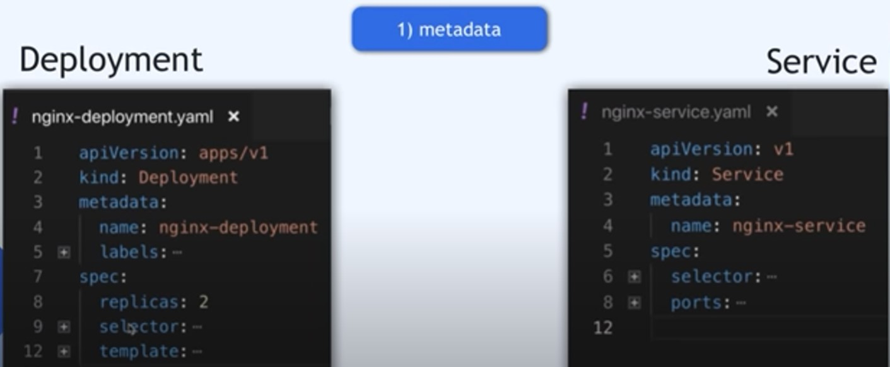
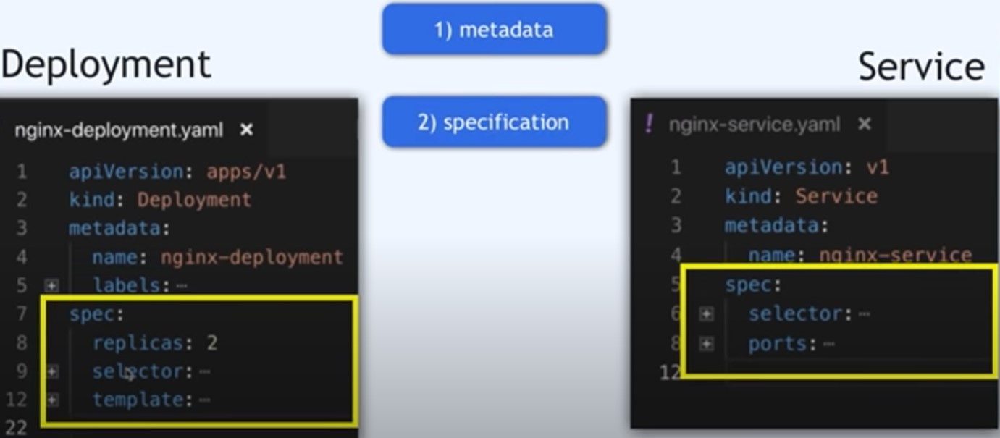

# 3 Parts of a Kubernetes Configuration File

## Links
---

---

## Part One - Metadata
---

    

## Part Two - Specification
---

    

## Part Three - Status
---
- A __Status__ is automatically generated and added by Kubernetes!

- Kubernetes trys to compare the __DESIRED__ and the __ACTUAL__ to see if they are the same. If the actual state is not the same as the desired state, Kubernetes will try and fix it. That is Kubernetes way of self healing.

- Where does K9s get this STATUS DATA?S
ETCD

the ETCD holds the current status of any K8s component!

