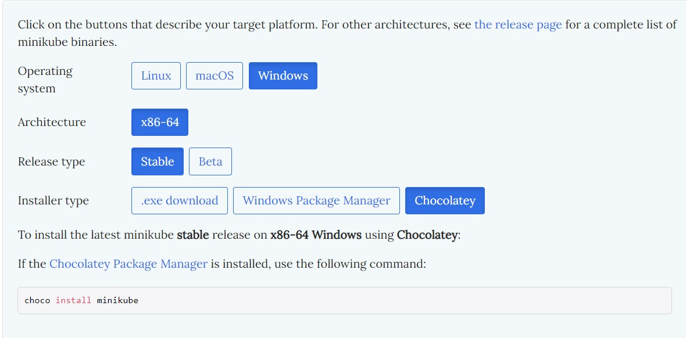

# Setup k8s cluster locally

MiniKube must be run ina container runtime (Docker) or a virtual machine (VirtualBox) on a laptop or pc.

1. First go to minikube website
https://minikube.sigs.k8s.io/docs/start/

- Ensure you have the minimum resources

    - 2 CPUs or more
    - 2GB of free RAM
    - 20GB of free disk space
    - Internet connection
    - Container or Virtual machine manager, such as Docker, Hyperkit, Hyper-V or something like it.

2. Select the the information to downlown the correct software.

    

3. Open a terminal in admin mode and enter command given.

`choco install minikube`

- we have two layers of Docker.
1. Minikube runs as a Docker container

2. Docker runs inside Minikube to run our application containers

