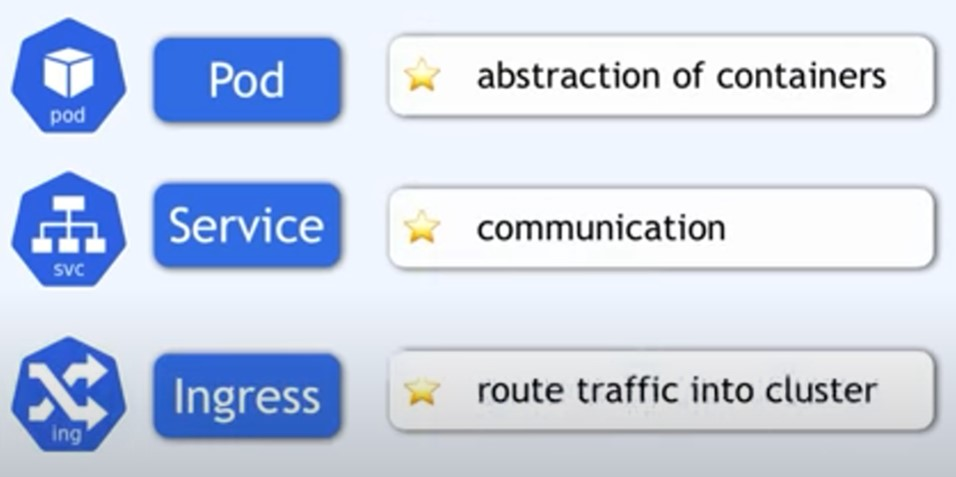
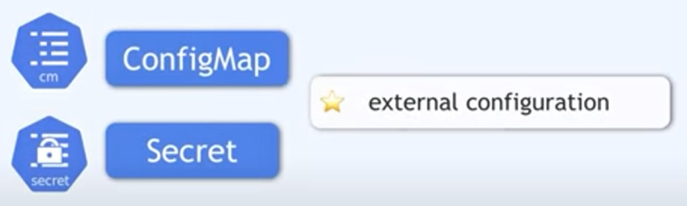
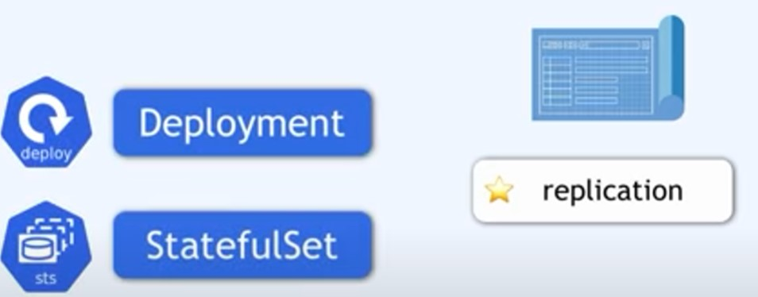

# Main Kubernetes components

## Links
---
- __[Nodes and pods](./nodes-and-pods.md)__
- __[Service](./service.md)__
- __[ConfigMap](./ConfigMap.md)__
- __[Ingress](./Ingress.md)__
- __[Secret](./secret.md)__
- __[Volume](./volume.md)__
- __[Deployment](./Deployment.md)__
- __[StatefulSet](./statefulSet.md)__
- __[DaemonSet](./DaemonSet.md)__
---

    
 

 

    

    
    

    
    

