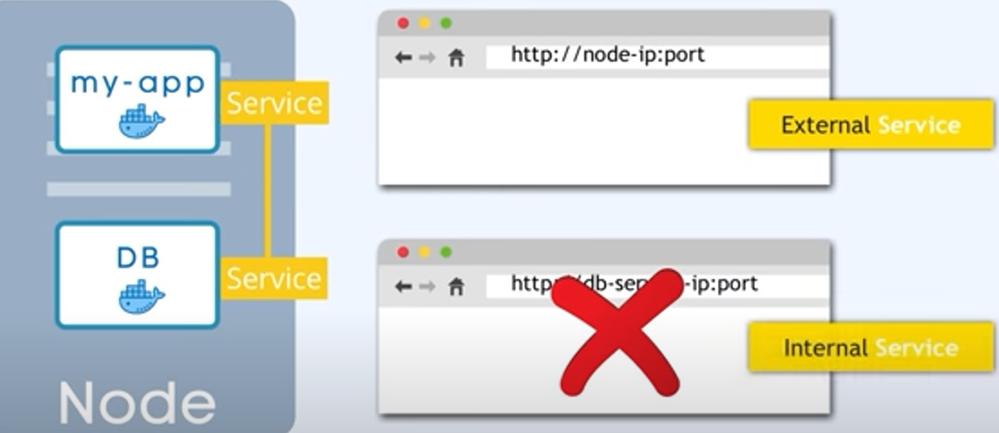

# Service

    

- __Permanent IP address__
- Lifecycle of Pod and Service __not connected__. This means that if your POD dies for any reason, the service will connect to the new POD's IP and continue the any tasks given. Mean no noticable downtime.

## Applications

- Applications should be accessible through browser, we do this by using an __External service__.

## Database
- But if the application has a database attached, we don't want user to have access to the database, we use an __internal Service__ to make the connection between application and database private so only the application can access the database.

### Services Access Diagram

    

