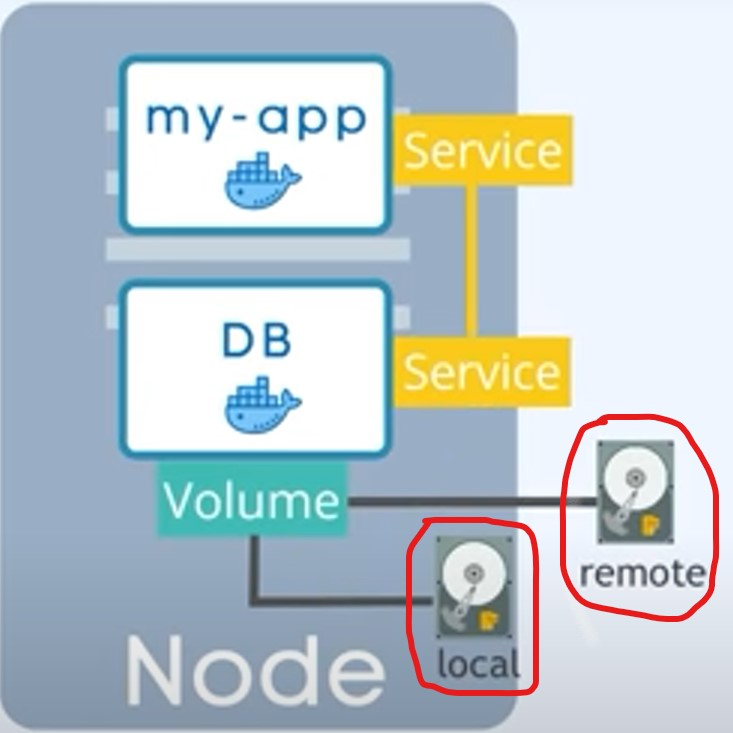

# [Volumes](https://kubernetes.io/docs/concepts/storage/volumes/) 

## Links
---

- [What are Volumes?](#what-are-bvolumesb)
- [Background of Volumes](#background-of-volumes)

---

    

## What are Volumes?
---
On-disk files in a container are ephemeral, which presents some problems for non-trivial applications when running in containers. One problem is the loss of files when a container crashes. The kubelet restarts the container but with a clean state. A second problem occurs when sharing files between containers running together in a `Pod`. The Kubernetes volume abstraction solves both of these problems. Familiarity with [Pods](https://kubernetes.io/docs/concepts/workloads/pods/) is suggested.

## Background of Volumes
---
Docker has a concept of volumes, though it is somewhat looser and less managed. A Docker volume is a directory on disk or in another container. Docker provides volume drivers, but the functionality is somewhat limited.

Kubernetes supports many types of volumes. A Pod can use any number of volume types simultaneously. Ephemeral volume types have a lifetime of a pod, but persistent volumes exist beyond the lifetime of a pod. When a pod ceases to exist, Kubernetes destroys ephemeral volumes; however, Kubernetes does not destroy persistent volumes. For any kind of volume in a given pod, data is preserved across container restarts.

At its core, a volume is a directory, possibly with some data in it, which is accessible to the containers in a pod. How that directory comes to be, the medium that backs it, and the contents of it are determined by the particular volume type used.

To use a volume, specify the volumes to provide for the Pod in .spec.volumes and declare where to mount those volumes into containers in .spec.containers[*].volumeMounts. A process in a container sees a filesystem view composed from the initial contents of the container image, plus volumes (if defined) mounted inside the container. The process sees a root filesystem that initially matches the contents of the container image. Any writes to within that filesystem hierarchy, if allowed, affect what that process views when it performs a subsequent filesystem access. Volumes mount at the specified paths within the image. For each container defined within a Pod, you must independently specify where to mount each volume that the container uses.

Volumes cannot mount within other volumes (but see Using subPath for a related mechanism). Also, a volume cannot contain a hard link to anything in a different volume.